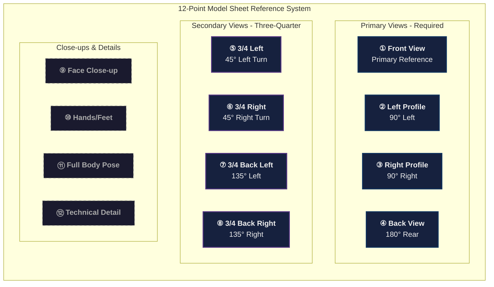

# AI Avatar Workflow

## *Enterprise-Ready Framework for High-Quality, Scalable Avatar Creation*

---

## Executive Summary

This comprehensive workflow enables the creation of photorealistic, brand-consistent AI avatars with full 360° fidelity and unlimited contextual variations. Designed for agencies, brands, and creative studios requiring production-grade deliverables at scale.

| Metric | Standard Workflow | Enhanced Workflow |
| --- | --- | --- |
| Total Time | 8-10 minutes | 15-25 minutes |
| Output Quality | Good | Production-Grade |
| Consistency Score | ~85% | 95-99% |
| Scalability | Limited | Enterprise-Ready |
| Use Cases | Basic | Comprehensive |

---

## 🛠️ Tool Stack & Infrastructure

### Primary Generation Tools

| Category | Recommended Tools | Use Case |
| --- | --- | --- |
| Base Generation | Midjourney V6, DALL-E 3, Stable Diffusion XL | Initial model creation |
| Consistency Engine | Weavy, IP-Adapter, InstantID | Identity preservation |
| Upscaling | Magnific AI, Topaz Gigapixel, Real-ESRGAN | Resolution enhancement |
| Face Refinement | FaceChain, PhotoMaker, GFPGAN | Facial detail optimization |
| Pose Control | ControlNet, DensePose, OpenPose | Precise pose manipulation |
| Background/Context | Banana Pro, [Scenario.gg](http://scenario.gg/), Leonardo AI | Environment generation |
| Quality Assurance | Pixlr, Photoshop (Neural Filters), Lightroom | Final polish |

### Hardware Requirements

```
Minimum Specifications:
├── GPU: NVIDIA RTX 3080 (12GB VRAM) or equivalent
├── RAM: 32GB DDR4
├── Storage: 500GB NVMe SSD
└── Internet: 100+ Mbps (for cloud-based tools)

Recommended Specifications:
├── GPU: NVIDIA RTX 4090 (24GB VRAM)
├── RAM: 64GB DDR5
├── Storage: 2TB NVMe SSD
└── Internet: 500+ Mbps dedicated

```

---

## 📋 PHASE 1: Strategic Planning & Brand Alignment

### Objective

Establish clear parameters, brand guidelines, and quality benchmarks before generation begins.

### 1.1 Client Discovery Questionnaire

```markdown
## Avatar Brief Template

### Brand Identity
- Brand name: ________________
- Industry vertical: ________________
- Target demographic: ________________
- Brand personality (3-5 keywords): ________________
- Competitor references (avoid): ________________

### Avatar Specifications
- Purpose: [ ] E-commerce  [ ] Social Media  [ ] Marketing  [ ] Corporate  [ ] Entertainment
- Realism level: [ ] Photorealistic  [ ] Stylized  [ ] Illustrated
- Exclusivity: [ ] Exclusive rights  [ ] Non-exclusive  [ ] Limited use

### Technical Requirements
- Primary platform(s): ________________
- Resolution requirements: ________________
- File format preferences: ________________
- Color profile: [ ] sRGB  [ ] Adobe RGB  [ ] P3

```

### 1.2 Avatar Persona Development

| Attribute | Options | Considerations |
| --- | --- | --- |
| Gender Expression | Male, Female, Non-binary, Androgynous | Market research, brand alignment |
| Age Presentation | 18-25, 26-35, 36-45, 46-55, 55+ | Target audience demographics |
| Ethnicity/Heritage | Diverse options | Market representation, cultural sensitivity |
| Body Type | Various builds | Inclusivity, product requirements |
| Style Archetype | High Fashion, Commercial, Editorial, Lifestyle, Athletic, Corporate | Brand positioning |

### 1.3 Mood Board Creation

Required Elements:

- 5-10 reference images for overall aesthetic
- 3-5 facial structure references
- 3-5 styling/fashion references
- 2-3 lighting/atmosphere references
- Color palette extraction (primary, secondary, accent)

Output: Comprehensive creative brief document (PDF/Notion)

---

## 📋 PHASE 2: Base Model Generation

### Objective

Generate multiple high-fidelity base models with optimal characteristics for consistency scaling.

### 2.1 Prompt Engineering Framework

### Master Prompt Structure

```
[STYLE MODIFIER] [SUBJECT DESCRIPTION] [PHYSICAL ATTRIBUTES]
[CLOTHING/STYLING] [LIGHTING SETUP] [CAMERA SETTINGS]
[QUALITY MODIFIERS] [NEGATIVE PROMPTS]

```

### Component Breakdown

Style Modifiers:

```
Professional fashion photography, editorial portrait,
commercial beauty shot, high-end advertising campaign,
luxury brand aesthetic, vogue magazine style

```

Physical Attribute Template:

```
[ethnicity] [gender] model, [age] years old, [face shape] face,
[eye color] eyes, [hair color] [hair length] [hair texture] hair,
[skin tone] skin with [skin quality], [distinctive features],
[body type] build, [height impression]

```

Quality Modifiers (Essential):

```
8K UHD, hyperrealistic, professional color grading,
sharp focus on face, subtle skin texture visible,
catch lights in eyes, natural skin pores,
fine hair detail, professional retouching aesthetic,
shot on Hasselblad H6D-400C, 85mm f/1.4 lens

```

Negative Prompts (Critical):

```
--no deformed, distorted, disfigured, poorly drawn,
bad anatomy, wrong anatomy, extra limbs, missing limbs,
floating limbs, disconnected limbs, mutation, mutated,
ugly, disgusting, amputation, duplicate, watermark,
signature, text, blurry, out of focus, bad quality,
low resolution, plastic skin, waxy skin, oversaturated

```

### 2.2 Generation Protocol


Step-by-Step Process:

1. Batch Generation (24 variations)
    - Run 4 batches of 6 images each
    - Vary seed values systematically
    - Maintain core prompt consistency
    - Document all parameters
2. First-Pass Filtering (→12 images)
    - Eliminate anatomical errors
    - Remove inconsistent lighting
    - Filter out poor compositions
    - Discard low-resolution outputs
3. Consistency Analysis (→6 images)
    - Compare facial geometry
    - Assess reproducibility potential
    - Evaluate feature distinctiveness
    - Check for "generatable" qualities
4. Client Presentation (→3 images)
    - Prepare comparison grid
    - Include rationale for each selection
    - Provide mock-up applications
5. Final Selection (→1 image)
    - Client approval
    - Document selection reasoning
    - Archive alternatives for future use

### 2.3 Quality Benchmarks

| Criteria | Minimum Standard | Production Grade |
| --- | --- | --- |
| Resolution | 1024×1024 | 4096×4096+ |
| Facial Symmetry | 90% | 95%+ |
| Skin Texture | Visible pores | Micro-detail visible |
| Eye Quality | Clear irises | Catch lights + depth |
| Hair Detail | Grouped strands | Individual strands |
| Lighting | Even exposure | Dimensional + motivated |

Output: 1 selected base model + 2 approved alternatives

---

## 📋 PHASE 3: Identity Lock & Model Sheet Creation

### Objective

Establish immutable identity parameters and generate comprehensive reference documentation for perfect consistency.

### 3.1 Identity Embedding Process

### Face Encoding Protocol

```
Identity Lock Workflow:
├── Extract facial landmarks (68-point detection)
├── Generate face embedding vector
├── Create identity reference pack
│   ├── Neutral expression (primary)
│   ├── Slight smile
│   ├── Profile left
│   ├── Profile right
│   └── Three-quarter views
├── Train LoRA/DreamBooth (if using SD)
└── Validate identity preservation score

```

### Consistency Parameters to Lock

| Parameter | Lock Method | Variance Allowed |
| --- | --- | --- |
| Facial geometry | Embedding + ControlNet | <2% |
| Skin tone | RGB values + relative luminance | ±5% |
| Eye color | Hex code reference | ±3% |
| Hair color | Multiple lighting samples | ±8% |
| Body proportions | Height ratios documented | ±3% |
| Distinctive features | Explicit prompting | 0% |

### 3.2 Comprehensive Model Sheet

### Required Views (12-Point System)



### Additional Required Elements

| View # | Description | Purpose | Priority |
| --- | --- | --- | --- |
| ⑨ | Face Close-up | Facial detail reference | Critical |
| ⑩ | Hand Detail | Gesture/product holding | High |
| ⑪ | Full Body (Standing) | Proportion reference | Critical |
| ⑫ | Full Body (Seated) | Alternative pose base | Medium |

### 3.3 Expression Library

Minimum Expression Set (8 expressions):

```
1. Neutral (baseline)
2. Subtle smile (commercial default)
3. Genuine smile with teeth
4. Serious/Confident
5. Contemplative/Thoughtful
6. Surprised/Delighted
7. Candid laugh
8. Professional/Corporate

```

Extended Expression Set (16 expressions):
Add: Curious, Determined, Relaxed, Playful, Mysterious, Warm, Energetic, Sophisticated

### 3.4 Documentation Package

```markdown
## Model Sheet Documentation

### Identity Card
- Model ID: [UNIQUE_ID]
- Creation Date: [DATE]
- Version: [X.X]
- Primary Artist/Creator: [NAME]

### Physical Specifications
| Attribute | Value | Hex/RGB |
|-----------|-------|---------|
| Skin Tone | [Description] | #[XXXXXX] |
| Eye Color | [Description] | #[XXXXXX] |
| Hair Color | [Description] | #[XXXXXX] |
| Lip Color | [Description] | #[XXXXXX] |

### Prompt DNA
[Core prompt components that produce this model]

### Consistency Score
- Self-similarity test: [XX]%
- Cross-generation stability: [XX]%

```

Output: Complete model sheet package (12+ reference images + documentation)

---

## 📋 PHASE 4: Wardrobe & Styling System

### Objective

Create a comprehensive wardrobe library that maintains model consistency while enabling unlimited outfit variations.

### 4.1 Wardrobe Categories

[https://visualize.graphy.app/view/0d793ff1-ae72-4d36-b7c7-08c55627dbf8](https://visualize.graphy.app/view/0d793ff1-ae72-4d36-b7c7-08c55627dbf8)

### 4.2 Styling Prompt Templates

### Casual/Lifestyle

```
[MODEL REFERENCE] wearing [casual outfit description],
relaxed fit, contemporary streetwear aesthetic,
[color palette], [fabric texture visible],
styled with [accessories], [footwear]

```

### Business/Corporate

```
[MODEL REFERENCE] in professional attire,
[suit/blazer/dress description], tailored fit,
executive styling, [neutral/power colors],
polished appearance, [appropriate accessories]

```

### Editorial/High Fashion

```
[MODEL REFERENCE] in avant-garde fashion,
[designer aesthetic], architectural silhouettes,
editorial lighting, high contrast styling,
[bold color or monochromatic], statement pieces

```

### 4.3 Accessory Integration

| Category | Items | Consistency Notes |
| --- | --- | --- |
| Eyewear | Sunglasses, prescription frames | Match face shape |
| Jewelry | Watches, necklaces, earrings, rings | Consistent style tier |
| Bags | Handbags, backpacks, clutches | Scale appropriately |
| Headwear | Hats, caps, headbands | Maintain hair visibility |
| Footwear | Sneakers, heels, boots, sandals | Proportion consistency |

Output: Wardrobe library (30-40 outfit combinations documented)

---

## 📋 PHASE 5: Context & Scenario Generation

### Objective

Generate production-ready contextual images across diverse environments while maintaining perfect model consistency.

### 5.1 Environment Categories

### Studio Environments

```
Category: Controlled Studio
├── White cyclorama (e-commerce standard)
├── Colored seamless backgrounds
├── Textured backdrops (concrete, fabric, gradient)
├── Product photography setup
└── Editorial studio with props

```

### Location Environments

```
Category: Real-World Locations
├── Urban
│   ├── City streets
│   ├── Coffee shops/Cafés
│   ├── Modern architecture
│   └── Rooftop settings
├── Nature
│   ├── Beach/Coastal
│   ├── Forest/Mountains
│   ├── Parks/Gardens
│   └── Desert/Arid landscapes
├── Interior
│   ├── Luxury home
│   ├── Modern office
│   ├── Hotel/Resort
│   └── Retail environment
└── Travel
    ├── Airport/Transit
    ├── Tourist destinations
    ├── Cultural landmarks
    └── Adventure settings

```

### 5.2 Lighting Scenarios

[https://visualize.graphy.app/view/dd8ae332-5b1c-44ea-89fc-f9a611d8590c](https://visualize.graphy.app/view/dd8ae332-5b1c-44ea-89fc-f9a611d8590c)

### 5.3 Pose Library

### Standing Poses

| Pose ID | Name | Best For | Difficulty |
| --- | --- | --- | --- |
| ST-01 | Confident Stand | Corporate, Editorial | Low |
| ST-02 | Weight Shift | Lifestyle, Fashion | Low |
| ST-03 | Hand on Hip | Commercial, E-commerce | Low |
| ST-04 | Arms Crossed | Corporate, Fitness | Medium |
| ST-05 | Walking Motion | Lifestyle, Street | Medium |
| ST-06 | Dynamic Movement | Editorial, Athletic | High |

### Seated Poses

| Pose ID | Name | Best For | Difficulty |
| --- | --- | --- | --- |
| SE-01 | Professional Seated | Corporate, Interview | Low |
| SE-02 | Casual Lounge | Lifestyle, Home | Low |
| SE-03 | Cross-legged | Wellness, Casual | Medium |
| SE-04 | Perched/Edge | Editorial, Modern | Medium |

### Action Poses

| Pose ID | Name | Best For | Difficulty |
| --- | --- | --- | --- |
| AC-01 | Product Interaction | E-commerce, Tech | Medium |
| AC-02 | Device Usage | Tech, Lifestyle | Medium |
| AC-03 | Athletic Movement | Fitness, Sport | High |
| AC-04 | Social Interaction | Lifestyle, Group | High |

### 5.4 Context Generation Workflow

```
For each scenario:
1. Load model reference (from Phase 3)
2. Select environment template
3. Choose lighting preset
4. Define pose requirements
5. Generate 4-6 variations
6. Quality filter (2-3 best)
7. Enhancement pass
8. Final selection

```

### 5.5 Scenario Prompt Structure

```
[MODEL REFERENCE/EMBEDDING], [pose description],
in [environment description], [time of day],
[lighting conditions], [atmosphere/mood],
[camera angle], [focal length equivalent],
[depth of field], [color grading style],
professional photography, magazine quality,
[technical specifications]

```

Example - Lifestyle Coffee Shop:

```
[Sarah_Avatar_v2.1], sitting at a marble café table,
holding a ceramic latte cup, genuine warm smile,
in a modern minimalist coffee shop, afternoon,
soft natural window light from the left, warm cozy atmosphere,
eye-level angle, 50mm equivalent,
shallow depth of field with bokeh background,
warm neutral color grading, lifestyle photography,
shot on Sony A7R V, f/2.0, natural skin tones

```

Output: 15-25 contextual images across 5-8 scenario categories

---

## 📋 PHASE 6: Post-Processing & Enhancement

### Objective

Elevate generated images to commercial-grade quality through systematic enhancement protocols.

### 6.1 Enhancement Pipeline

```mermaid
graph LR
    %% Title
    subgraph Enhancement_Pipeline_Flow [Enhancement Pipeline Flow]
        direction LR

        %% Stages
        S1["<b>STAGE 1: Upscaling</b><br/>2-4x Resolution<br/>Detail Recovery<br/><i>~30s</i>"]
        QC1((QC-1))
        S2["<b>STAGE 2: Face Refine</b><br/>GFPGAN/CodeFormer<br/>Eye Enhancement<br/><i>~20s</i>"]
        S3["<b>STAGE 3: Color Grade</b><br/>LUT Application<br/>Tone Mapping<br/><i>~15s</i>"]
        QC2((QC-2))
        S4["<b>STAGE 4: Skin Retouch</b><br/>Frequency Sep<br/>Texture Preserve<br/><i>~45s</i>"]
        S5["<b>STAGE 5: Artifact Fix</b><br/>Hand/Detail Fix<br/>Edge Cleanup<br/><i>~60s</i>"]
        QC3((QC-3))
        S6["<b>STAGE 6: Final Polish</b><br/>Sharpening<br/>Output Prep<br/><i>~20s</i>"]

        %% Connections
        S1 --> QC1 --> S2 --> S3 --> QC2 --> S4 --> S5 --> QC3 --> S6
    end

    %% Legend/Note
    Note[Total Processing Time: ~3-4 mins/image]
    Note --- Enhancement_Pipeline_Flow

    %% Styling
    style S1 fill:#e94560,stroke:#fff,color:#fff
    style S2 fill:#c94560,stroke:#fff,color:#fff
    style S3 fill:#a94560,stroke:#fff,color:#fff
    style S4 fill:#894560,stroke:#fff,color:#fff
    style S5 fill:#594560,stroke:#fff,color:#fff
    style S6 fill:#0f3460,stroke:#fff,color:#fff
    
    style QC1 fill:#4CAF50,stroke:#fff,color:#fff
    style QC2 fill:#4CAF50,stroke:#fff,color:#fff
    style QC3 fill:#4CAF50,stroke:#fff,color:#fff
    
    style Note fill:none,stroke:none,color:#888
```



### 6.2 Upscaling Specifications

| Source Resolution | Target Resolution | Upscaler | Settings |
| --- | --- | --- | --- |
| 1024×1024 | 2048×2048 | Real-ESRGAN | x2, denoise: 0.3 |
| 1024×1024 | 4096×4096 | Magnific AI | x4, creativity: low |
| 2048×2048 | 8192×8192 | Topaz Gigapixel | x4, face recovery: on |

### 6.3 Color Grading Presets

```
Preset Library:
├── Commercial Neutral (sRGB optimized)
├── Warm Lifestyle (golden undertones)
├── Cool Editorial (blue shadows)
├── High Contrast Fashion (crushed blacks)
├── Soft Luxury (lifted blacks, muted)
├── Vibrant Pop (saturated, punchy)
├── Film Emulation (Portra 400, Ektar 100)
└── Custom Brand LUT (client-specific)

```

### 6.4 Common Artifact Fixes

| Issue | Detection | Solution |
| --- | --- | --- |
| Hand Deformities | Manual review | Inpaint + ControlNet redraw |
| Eye Asymmetry | AI detection | Targeted face restoration |
| Hair Artifacts | Edge detection | Selective inpainting |
| Background Bleeding | Mask analysis | Clean edge refinement |
| Clothing Distortion | Pattern analysis | Regional regeneration |
| Skin Texture Loss | Detail comparison | Texture overlay/restoration |

Output: Production-ready images (per specifications)

---

## 📋 PHASE 7: Quality Assurance & Delivery

### 7.1 Comprehensive QA Checklist

### Technical Quality

- [ ]  Resolution meets or exceeds specifications
- [ ]  No visible compression artifacts
- [ ]  Proper color space (sRGB/Adobe RGB as specified)
- [ ]  Correct aspect ratios for all deliverables
- [ ]  File sizes optimized without quality loss

### Identity Consistency

- [ ]  Facial features match reference (95%+ similarity)
- [ ]  Skin tone consistent across all images
- [ ]  Eye color consistent
- [ ]  Hair color/style consistent
- [ ]  Body proportions maintained
- [ ]  Distinctive features preserved

### Technical Execution

- [ ]  No anatomical errors
- [ ]  Hands rendered correctly
- [ ]  Eyes have proper catch lights
- [ ]  Hair detail is natural
- [ ]  Clothing fits naturally
- [ ]  Backgrounds are clean/appropriate

### Artistic Quality

- [ ]  Lighting is motivated and consistent
- [ ]  Color grading matches brief
- [ ]  Composition follows guidelines
- [ ]  Poses appear natural
- [ ]  Expressions are appropriate
- [ ]  Overall aesthetic matches brand

### 7.2 Consistency Scoring System


### 7.3 File Organization Structure

```
Project_[ClientName]_[AvatarName]_[Date]/
├── 00_Documentation/
│   ├── Creative_Brief.pdf
│   ├── Avatar_Identity_Card.pdf
│   ├── Prompt_Documentation.md
│   └── Revision_History.md
│
├── 01_Model_Sheet/
│   ├── Primary_Views/
│   │   ├── [Avatar]_Front_4K.png
│   │   ├── [Avatar]_Left_Profile_4K.png
│   │   ├── [Avatar]_Right_Profile_4K.png
│   │   └── [Avatar]_Back_4K.png
│   ├── Secondary_Views/
│   │   └── [8 three-quarter views]
│   └── Close_Ups/
│       ├── [Avatar]_Face_Detail.png
│       └── [Avatar]_Full_Body.png
│
├── 02_Expression_Library/
│   ├── [Avatar]_Neutral.png
│   ├── [Avatar]_Smile.png
│   └── [Additional expressions]
│
├── 03_Wardrobe/
│   ├── Casual/
│   ├── Business/
│   ├── Formal/
│   ├── Athletic/
│   └── Seasonal/
│
├── 04_Contextual_Images/
│   ├── Studio/
│   ├── Urban/
│   ├── Nature/
│   ├── Interior/
│   └── Lifestyle/
│
├── 05_Web_Optimized/
│   ├── Social_Media/
│   │   ├── Instagram_Square/
│   │   ├── Instagram_Story/
│   │   ├── LinkedIn/
│   │   └── Twitter/
│   └── Website/
│       ├── Hero_Images/
│       └── Thumbnails/
│
└── 06_Source_Files/
    ├── PSD_Files/
    ├── Raw_Generations/
    └── Project_Files/

```

### 7.4 Delivery Specifications

| Use Case | Format | Resolution | Color Space | Compression |
| --- | --- | --- | --- | --- |
| Print (High-End) | TIFF | 300 DPI, 8K+ | Adobe RGB | Lossless |
| Print (Standard) | PNG | 300 DPI, 4K | sRGB | Lossless |
| Web (Hero) | WebP/PNG | 2048px wide | sRGB | 85% quality |
| Web (Standard) | WebP/JPEG | 1200px wide | sRGB | 80% quality |
| Social Media | JPEG/PNG | Platform-specific | sRGB | 90% quality |
| Thumbnail | WebP | 400px wide | sRGB | 75% quality |

Output: Complete delivery package with all specifications met

---

## 📊 Workflow Metrics & Time Allocation

### Detailed Time Breakdown

[https://visualize.graphy.app/view/0fecf4b0-f9c0-431b-a51d-118a21744f63](https://visualize.graphy.app/view/0fecf4b0-f9c0-431b-a51d-118a21744f63)

### Scalability Metrics

| Volume | Time per Avatar | Hourly Output | Daily Capacity |
| --- | --- | --- | --- |
| Single | 25-35 min | 2 avatars | 16 avatars |
| Batch (5) | 20-25 min avg | 2.5 avatars | 20 avatars |
| Batch (10) | 18-22 min avg | 3 avatars | 24 avatars |
| Enterprise (20+) | 15-18 min avg | 3.5 avatars | 28 avatars |

---

## 🚀 Advanced Techniques & Pro Tips

### Consistency Maximization

1. Seed Locking: Document and reuse successful seeds
2. Prompt Anchoring: Keep 80% of prompt constant, vary only context
3. Reference Weighting: Use higher reference strength (0.7-0.85) for critical features
4. Multi-stage Generation: Generate base → refine face → add context (separate passes)
5. A/B Testing: Always generate comparison sets to identify drift

### Quality Acceleration

1. Template Libraries: Pre-build prompt templates for common scenarios
2. Batch Processing: Group similar tasks (all upscaling together, all color grading together)
3. Parallel Generation: Run multiple tools simultaneously
4. Preset Automation: Create Photoshop actions/Lightroom presets for repetitive tasks
5. Quality Gates: Implement automated checks before proceeding to next phase

### Common Pitfalls & Solutions

| Pitfall | Impact | Prevention | Solution |
| --- | --- | --- | --- |
| Identity Drift | Model looks different across images | Strong reference embedding | Re-anchor to model sheet |
| Uncanny Valley | Viewer discomfort | Natural lighting, subtle imperfections | Add micro-details, reduce symmetry |
| Hand Issues | Unprofessional output | Pose selection, occlusion | Manual inpainting, ControlNet |
| Over-processing | Plastic/fake appearance | Light touch on enhancement | Reset and use minimal processing |
| Inconsistent Lighting | Disjointed portfolio | Document light setups | Standardize lighting presets |

### Premium Add-On Services

```markdown
## Value-Add Services

### Motion & Animation
- [ ] Talking head video generation (D-ID, HeyGen)
- [ ] Body motion capture application
- [ ] GIF/Cinemagraph creation

### Customization Packages
- [ ] Aging/de-aging variants
- [ ] Seasonal appearance changes
- [ ] Special occasion styling

### Extended Assets
- [ ] Product integration photography
- [ ] Group/multi-avatar compositions
- [ ] Environmental storytelling series

### Technical Deliverables
- [ ] 3D model conversion (for VR/AR)
- [ ] Green screen/transparent backgrounds
- [ ] Layered PSD source files

```

---

## 📁 Client Delivery Template

### Delivery Checklist Email

```markdown
Subject: [Project Name] - AI Avatar Delivery Complete

Dear [Client Name],

Your AI avatar project is complete! Please find attached/linked:

📦 Delivery Package Contents:

1. Model Sheet (12 images)
   - 4 primary views (front, back, left, right profiles)
   - 8 secondary views (three-quarter angles, close-ups)

2. Expression Library (8 expressions)
   - Neutral through energetic range

3. Wardrobe Collection ([X] outfits)
   - Casual: [X] | Business: [X] | Formal: [X]

4. Contextual Imagery ([X] images)
   - Organized by scenario/environment

5. Web-Optimized Versions
   - Social media crops included
   - Multiple resolution options

📋 Technical Specifications:
- Primary resolution: [X]×[X] pixels
- Color space: [sRGB/Adobe RGB]
- File formats: [PNG/JPEG/TIFF]

🔐 Usage Rights:
[Insert licensing terms]

📞 Next Steps:
[Insert revision/feedback process]

Best regards,
[Your Name]

```

---

## 🔄 Continuous Improvement Framework

### Version Control

- Maintain avatar versions (v1.0, v1.1, v2.0)
- Document all prompt refinements
- Archive successful generation parameters

### Feedback Integration

- Collect client satisfaction scores
- Track common revision requests
- Update templates based on patterns

### Technology Updates

- Monthly tool evaluation
- Quarterly workflow optimization
- Annual full process review

---

## 📚 Appendix

### A. Prompt Library Templates

<details>
<summary>Click to expand full prompt library</summary>

### Fashion/Editorial

```
[IDENTITY_TOKEN], high fashion editorial portrait, wearing [OUTFIT],
[POSE] pose, [ENVIRONMENT] setting, dramatic [LIGHTING] lighting,
shot on Phase One IQ4 150MP, 110mm lens, f/2.8, magazine cover quality,
Vogue aesthetic, sophisticated color grading, sharp focus, 8K resolution

```

### Commercial/E-commerce

```
[IDENTITY_TOKEN], professional product photography model,
wearing [PRODUCT/OUTFIT], clean [POSE], white cyclorama background,
soft diffused studio lighting from 45 degrees, even exposure,
shot on Canon EOS R5, 85mm lens, f/8, e-commerce standard,
neutral color accurate, full body visible, centered composition

```

### Lifestyle/Social

```
[IDENTITY_TOKEN], authentic lifestyle moment, [ACTION/ACTIVITY],
in [REAL_WORLD_LOCATION], [TIME_OF_DAY] natural lighting,
candid [EXPRESSION] expression, [OUTFIT] outfit,
shot on Sony A7IV, 35mm lens, f/2.0, shallow depth of field,
warm inviting color grade, Instagram aesthetic, genuine emotion

```

</details>

### B. Tool Configuration Presets

<details>
<summary>Click to expand tool presets</summary>

### Midjourney V6

```
--ar 3:4 --style raw --s 250 --c 15 --q 2

```

### Stable Diffusion XL

```
Steps: 40
Sampler: DPM++ 2M Karras
CFG Scale: 7.5
Denoising Strength: 0.75

```

### ControlNet Settings

```
OpenPose: Weight 1.0, Start 0, End 1
Canny: Weight 0.6, Start 0, End 0.8
IP-Adapter: Weight 0.85

```

</details>

### C. Troubleshooting Guide

| Issue | Likely Cause | Quick Fix |
| --- | --- | --- |
| Blurry output | Low CFG, over-denoising | Increase CFG to 8-9, reduce denoise |
| Wrong ethnicity | Prompt ambiguity | Add explicit ethnicity descriptors |
| Age inconsistency | Missing age anchors | Include specific age in every prompt |
| Lighting mismatch | Context override | Add lighting keywords with emphasis |
| Pose distortion | Complex pose request | Use ControlNet pose reference |

---