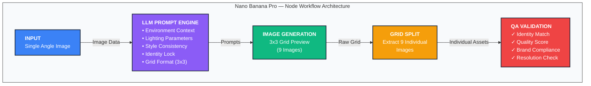

# Multi-Angle Workflow 1 Image → 100 Shots [Concise Version]

# Enterprise-Level Multi-Angle Visual Content Production Workflow

## Executive Summary

This comprehensive workflow transforms a single source image into 100+ professional-grade visual assets through systematic AI-powered generation, designed for enterprise scalability with integrated cross-functional collaboration, risk management, and continuous optimization protocols.

---

## Workflow Architecture Overview

```mermaid
graph LR
    classDef phase1 fill:#FFFFFF,stroke:#3B82F6,stroke-width:2px,color:#000000
    classDef phase2 fill:#FFFFFF,stroke:#10B981,stroke-width:2px,color:#000000
    classDef phase3 fill:#FFFFFF,stroke:#F59E0B,stroke-width:2px,color:#000000
    classDef phase4 fill:#FFFFFF,stroke:#8B5CF6,stroke-width:2px,color:#000000
    classDef sub1 fill:#FFFFFF,stroke:#3B82F6,stroke-width:1px,color:#000000
    classDef sub2 fill:#FFFFFF,stroke:#10B981,stroke-width:1px,color:#000000
    classDef sub3 fill:#FFFFFF,stroke:#F59E0B,stroke-width:1px,color:#000000
    classDef sub4 fill:#FFFFFF,stroke:#8B5CF6,stroke-width:1px,color:#000000
    classDef sub5 fill:#FFFFFF,stroke:#EF4444,stroke-width:1px,color:#000000

    T["<b>Enterprise Multi-Angle Workflow Architecture</b>"]

    subgraph Phases
        direction LR
        P1["<b>PHASE 1: PLANNING</b><br><br><b>Key Activities:</b><br>• Stakeholder Requirements<br>• Resource Allocation<br>• Risk Assessment<br>• Timeline Definition<br>• Quality Benchmarks<br><br><b>Teams:</b><br>Creative • Legal • Marketing<br><br><b>Duration:</b> 1-2 Days"]:::phase1 --> P2["<b>PHASE 2: EXECUTION</b><br><br><b>Key Activities:</b><br>• Base Image Processing<br>• Higgsfield Angle Gen (10x)<br>• Nano Banana Expansion (90x)<br>• Quality Checkpoints<br>• Version Control<br><br><b>Teams:</b><br>Production • QA • Tech Ops<br><br><b>Duration:</b> 15-30 Minutes"]:::phase2 --> P3["<b>PHASE 3: MONITORING</b><br><br><b>Key Activities:</b><br>• Real-time Quality Scoring<br>• Consistency Validation<br>• Brand Compliance Check<br>• Stakeholder Review Gates<br>• Performance Metrics<br><br><b>Teams:</b><br>QA • Brand • Analytics<br><br><b>Duration:</b> Continuous"]:::phase3 --> P4["<b>PHASE 4: OPTIMIZATION</b><br><br><b>Activities:</b><br>• A/B Testing<br>• ML Refinement<br>• Process Tuning<br>• ROI Analysis<br><br><b>Teams:</b><br>Data Science<br>Strategy<br><br><b>Cycle:</b> Weekly"]:::phase4
    end

    P4 -. "Continuous Improvement Feedback Loop" .-> P1

    T --> P1

    subgraph cross["CROSS-FUNCTIONAL INTEGRATION LAYER"]
        direction LR
        R["<b>Resource Allocation</b><br>• AI Credits Management<br>• Team Capacity Planning<br>• Tool License Allocation<br>• Budget Tracking"]:::sub1 --- S["<b>Stakeholder Comm</b><br>• Daily Standups<br>• Approval Workflows<br>• Progress Dashboards<br>• Escalation Protocols"]:::sub2 --- Risk["<b>Risk Management</b><br>• Quality Degradation<br>• Brand Compliance<br>• IP/Legal Concerns<br>• Technical Failures"]:::sub3 --- Scale["<b>Scalability Engine</b><br>• Parallel Processing<br>• Queue Management<br>• Auto-scaling Rules<br>• Load Balancing"]:::sub4 --- Gov["<b>Governance</b><br>• Usage Rights Tracking<br>• Audit Trails<br>• Compliance Reports<br>• Version Archives"]:::sub5
    end
    style cross fill:#FFFFFF,stroke:#64748B,stroke-width:2px
```



---

## Phase 1: Strategic Planning & Requirements Gathering

### 1.1 Stakeholder Alignment Workshop

| Stakeholder Group | Role | Key Inputs | Communication Cadence |
| --- | --- | --- | --- |
| Creative Director | Visual vision & brand guardian | Style guides, mood boards, quality standards | Daily review gates |
| Marketing Lead | Campaign requirements | Channel specifications, target audiences, messaging | Bi-daily sync |
| Legal/Compliance | IP & usage rights | Model releases, AI usage policies, licensing terms | Pre-launch sign-off |
| Product Owner | Feature prioritization | Business requirements, ROI targets | Sprint planning |
| Technical Lead | Infrastructure & tooling | API limits, processing capacity, integration points | Real-time monitoring |
| Finance | Budget & cost tracking | Cost caps, ROI thresholds, vendor contracts | Weekly reporting |

### 1.2 Resource Allocation Matrix

[https://visualize.graphy.app/view/e08ac8e0-82c7-4188-ad2d-555a836d5c07](https://visualize.graphy.app/view/e08ac8e0-82c7-4188-ad2d-555a836d5c07)

### 1.3 Risk Assessment Framework

| Risk Category | Description | Probability | Impact | Mitigation Strategy | Owner |
| --- | --- | --- | --- | --- | --- |
| Quality Degradation | AI-generated outputs fail consistency checks | Medium | High | Multi-stage QA gates, human review checkpoints | QA Lead |
| Brand Misalignment | Generated content violates brand guidelines | Medium | Critical | Pre-loaded brand guardrails, compliance scoring | Creative Director |
| Technical Failure | API outages, processing failures | Low | High | Redundant tool stack, manual fallback procedures | Tech Lead |
| Legal/IP Issues | Unclear usage rights, model consent gaps | Low | Critical | Pre-cleared base assets, legal review gate | Legal Counsel |
| Timeline Slippage | Delays from review cycles, rework | Medium | Medium | Buffer time allocation, parallel processing | Project Manager |
| Cost Overrun | Exceeding AI credit budgets | Medium | Medium | Real-time cost monitoring, tier-based alerts | Finance |

### 1.4 Project Timeline & Milestones

[https://visualize.graphy.app/view/effc99d4-8939-436b-900d-252c8917d273](https://visualize.graphy.app/view/effc99d4-8939-436b-900d-252c8917d273)

---

## Phase 2: Execution Framework

### 2.1 Stage 1 — Base Angle Generation (Higgsfield)

### Input Requirements Checklist

| Requirement | Specification | Validation Method |
| --- | --- | --- |
| Resolution | Minimum 2048×2048px | Automated pixel check |
| Format | PNG, JPEG (high quality) | File type validation |
| Lighting | Even, professional lighting | Human review |
| Subject Clarity | Clear focal point, no obstructions | AI clarity score |
| Background | Clean or contextually appropriate | Brand compliance check |
| Model Release | Signed consent for AI processing | Legal database verification |

### Higgsfield Processing Protocol

```
┌─────────────────────────────────────────────────────────────────┐
│                    HIGGSFIELD SHOT WORKFLOW                      │
├─────────────────────────────────────────────────────────────────┤
│                                                                  │
│  INPUT: 1 High-Quality Base Image                               │
│         ↓                                                        │
│  ┌──────────────────────────────────────────────────────────┐   │
│  │  AUTOMATED ANGLE GENERATION                               │   │
│  │  ─────────────────────────────────────────────────────── │   │
│  │  1. Aerial View           6. Wide Environmental          │   │
│  │  2. Side Profile          7. Over-the-Shoulder           │   │
│  │  3. Macro Close-up        8. Dutch Angle                 │   │
│  │  4. Worm's Eye View       9. Low Angle Heroic            │   │
│  │  5. 3/4 Portrait         10. High Angle Cinematic        │   │
│  └──────────────────────────────────────────────────────────┘   │
│         ↓                                                        │
│  QUALITY GATE 1: Consistency Score ≥ 85%                        │
│         ↓                                                        │
│  OUTPUT: 10 Angle Variants (Approved for Phase 2)               │
│                                                                  │
│  ⏱️ Time: ~30 seconds | 📊 Success Rate Target: 95%             │
└─────────────────────────────────────────────────────────────────┘

```

### Quality Gate 1 Criteria

| Metric | Threshold | Action if Failed |
| --- | --- | --- |
| Facial Consistency | ≥90% match score | Regenerate with enhanced prompt |
| Lighting Coherence | ≥85% variance tolerance | Apply post-processing correction |
| Composition Quality | ≥80% rule-of-thirds adherence | Manual crop adjustment |
| Resolution Integrity | No degradation >5% | Upscale using enhancement tools |
| Brand Color Accuracy | Delta E <5 | Color correction pipeline |

---

### 2.2 Stage 2 — Environment Variation Expansion (Nano Banana Pro)

### Node-Based Workflow Configuration



### Enterprise-Grade Prompt Templates

System Prompt (LLM Configuration):

```
ROLE: Enterprise Visual Content Prompt Engineer
OBJECTIVE: Generate Nano Banana Pro prompts that produce 9 environment variations
           in a 3×3 grid format while maintaining strict subject consistency.

CONSTRAINTS:
- Preserve exact facial features, body proportions, and clothing
- Maintain consistent lighting quality across all variations
- Ensure each environment is distinct yet thematically cohesive
- Follow brand guidelines: [INSERT BRAND PARAMETERS]
- Output resolution: 2048×2048 minimum per cell

OUTPUT FORMAT: Single prompt optimized for Nano Banana Pro execution.
Include: "The grid layout is clean and symmetrical with subtle separation lines.
Each photo is realistically lit and color-graded for a cohesive visual set.
The model's identity, outfit, and expression remain consistent across all shots.
High-resolution, photorealistic style. Maintain strict perfect facial and body consistency."

```

Environment Theme Prompt Library:

| Theme Category | Specific Prompt Enhancement |
| --- | --- |
| Luxury Travel | "...set in exclusive destinations: Monaco yacht deck, Santorini cliffside terrace, Maldives overwater bungalow, Swiss Alps chalet, Dubai rooftop lounge, Amalfi Coast promenade, Bali temple grounds, Tokyo luxury hotel suite, Paris penthouse balcony..." |
| Urban Diversity | "...across iconic city backdrops: Tokyo neon-lit Shibuya crossing, NYC Times Square at dusk, Paris Champs-Élysées, London Covent Garden, Dubai Marina promenade, Singapore Marina Bay, Barcelona Gothic Quarter, Amsterdam canal bridges, Hong Kong Victoria Peak..." |
| Natural Environments | "...immersed in diverse natural settings: tropical beach at golden hour, misty mountain peak, autumn forest clearing, desert dunes at sunset, waterfall cascade backdrop, lavender field in Provence, cherry blossom garden, snowy Nordic landscape, coastal cliff edge..." |
| Seasonal Progression | "...showing seasonal transitions in the same Central Park location: spring cherry blossoms, summer lush greenery, autumn golden leaves, early winter first snow, late winter bare trees, spring rain shower, summer sunset, autumn morning mist, winter twilight..." |

---

### 2.3 Parallel Processing Architecture

[https://visualize.graphy.app/view/dfcdd5b2-1c79-45d3-9b7f-2c8f0ff559b7](https://visualize.graphy.app/view/dfcdd5b2-1c79-45d3-9b7f-2c8f0ff559b7)

### Scalability Configuration

| Scale Tier | Concurrent Processes | Input Capacity | Output/Hour | Use Case |
| --- | --- | --- | --- | --- |
| Starter | 2 parallel | 1-5 base images | ~450 images | Small campaigns |
| Professional | 5 parallel | 5-20 base images | ~1,800 images | Mid-size brands |
| Enterprise | 10+ parallel | 20-100 base images | ~9,000 images | Large portfolios |
| Unlimited | Auto-scale | 100+ base images | ~50,000+ images | Agency/Platform |

---

## Phase 3: Monitoring & Quality Assurance

### 3.1 Real-Time Quality Dashboard


### 3.2 Approval Workflow Gates

```
┌────────────────────────────────────────────────────────────────────────────┐
│                        MULTI-TIER APPROVAL WORKFLOW                         │
├────────────────────────────────────────────────────────────────────────────┤
│                                                                             │
│  GATE 1: Automated QA                    GATE 2: Creative Review            │
│  ─────────────────────────               ───────────────────────            │
│  ✓ Identity score ≥ 90%                  ✓ Art Director approval            │
│  ✓ Resolution ≥ 2048px                   ✓ Brand guideline check            │
│  ✓ No artifacts detected                 ✓ Style consistency                │
│  ✓ Color accuracy Δ < 5                  ✓ Campaign fit assessment          │
│        ↓                                        ↓                           │
│  [Pass: Auto-advance]                    [Pass: Human sign-off]             │
│  [Fail: Auto-regenerate]                 [Fail: Feedback + rework]          │
│                                                                             │
│  ─────────────────────────────────────────────────────────────────────────  │
│                                                                             │
│  GATE 3: Legal/Compliance                GATE 4: Final Sign-off             │
│  ────────────────────────                ─────────────────────              │
│  ✓ Usage rights verified                 ✓ Stakeholder approval             │
│  ✓ No trademark issues                   ✓ Budget confirmation              │
│  ✓ Model release valid                   ✓ Distribution clearance           │
│  ✓ AI disclosure compliant               ✓ Archive & version lock           │
│        ↓                                        ↓                           │
│  [Pass: Clear for publish]               [Pass: RELEASED TO CHANNELS]       │
│  [Fail: Legal hold]                      [Fail: Executive escalation]       │
│                                                                             │
└────────────────────────────────────────────────────────────────────────────┘

```

### 3.3 Stakeholder Communication Protocol

| Event Type | Notification Channel | Recipients | Timing | Escalation Path |
| --- | --- | --- | --- | --- |
| Batch Started | Slack/Teams + Email | Production Team, PM | Immediate | N/A |
| QA Gate Pass | Dashboard Alert | QA Lead, Creative Director | Real-time | N/A |
| QA Gate Fail | Slack + Email | Production Team, Tech Lead | Immediate | → PM after 2 failures |
| Creative Review Ready | Email + Calendar | Art Director, Brand Manager | Scheduled | N/A |
| Approval Required | Email + SMS | Approvers | 24hr window | → Director after 48hrs |
| Legal Hold | Email + Phone | Legal, PM, Executive Sponsor | Immediate | → C-Suite if IP risk |
| Final Release | All Channels | All Stakeholders | On completion | N/A |
| Weekly Summary | Email Report | Leadership, Finance | Friday 5PM | N/A |

---

## Phase 4: Optimization & Continuous Improvement

### 4.1 Performance Analytics


### 4.2 A/B Testing Framework

| Test Variable | Variant A | Variant B | Success Metric | Duration |
| --- | --- | --- | --- | --- |
| Prompt Specificity | Generic environment | Detailed location names | Quality score + uniqueness | 2 weeks |
| Grid Size | 3×3 (9 images) | 4×4 (16 images) | Processing time + quality | 1 week |
| Lighting Instructions | AI-determined | Explicitly specified | Consistency score | 2 weeks |
| Identity Lock Strength | Standard prompt | Enhanced embedding | Facial match accuracy | 3 weeks |
| Processing Order | Sequential angles | Random sampling | Overall batch quality | 2 weeks |

### 4.3 Machine Learning Optimization Pipeline

```
┌─────────────────────────────────────────────────────────────────────────┐
│                    ML-DRIVEN OPTIMIZATION LOOP                          │
├─────────────────────────────────────────────────────────────────────────┤
│                                                                          │
│   ┌──────────────┐      ┌──────────────┐      ┌──────────────┐          │
│   │   DATA       │  →   │   MODEL      │  →   │   PROMPT     │          │
│   │   COLLECTION │      │   TRAINING   │      │   REFINEMENT │          │
│   └──────────────┘      └──────────────┘      └──────────────┘          │
│         ↑                                            ↓                   │
│         │                                            │                   │
│   ┌─────────────────────────────────────────────────────────┐           │
│   │                  FEEDBACK SIGNALS                        │           │
│   │  • Human approval/rejection data                         │           │
│   │  • Quality scores per generation                         │           │
│   │  • A/B test winner characteristics                       │           │
│   │  • User engagement metrics (downstream)                  │           │
│   │  • Brand compliance audit results                        │           │
│   └─────────────────────────────────────────────────────────┘           │
│                              ↓                                           │
│   ┌──────────────┐      ┌──────────────┐      ┌──────────────┐          │
│   │   DEPLOY     │  ←   │   VALIDATE   │  ←   │   TEST       │          │
│   │   UPDATES    │      │   RESULTS    │      │   NEW PROMPTS│          │
│   └──────────────┘      └──────────────┘      └──────────────┘          │
│                                                                          │
│   📈 Target: 5% quality improvement per optimization cycle               │
│   🔄 Cycle frequency: Weekly                                             │
└─────────────────────────────────────────────────────────────────────────┘

```

---

## Cost-Benefit Analysis

### 4.4 ROI Comparison

[https://visualize.graphy.app/view/e565fed6-2417-4431-9bb0-6249d3881806](https://visualize.graphy.app/view/e565fed6-2417-4431-9bb0-6249d3881806)

### Enterprise Value Metrics

| Metric | Traditional Approach | AI Workflow | Improvement |
| --- | --- | --- | --- |
| Time to Delivery | 3-5 days | 15-30 minutes | 99% faster |
| Cost per 100 Images | $30,000+ | ~$800 | 97% savings |
| Team Size Required | 12-15 people | 2-3 people | 80% reduction |
| Geographic Flexibility | Single location | Unlimited virtual | ∞ expansion |
| Iteration Speed | Days per revision | Minutes per revision | 100x faster |
| Carbon Footprint | High (travel, equipment) | Minimal (compute) | ~95% reduction |

---

## Governance & Compliance

### 5.1 Usage Rights Management

| Asset Type | Rights Scope | Tracking Method | Renewal Trigger |
| --- | --- | --- | --- |
| Base Image | Original model release | Legal database ID | Annual review |
| AI-Generated | Platform ToS dependent | Generation metadata | Per-platform policy |
| Final Outputs | Campaign-specific license | DAM tagging | Campaign end date |
| Derivatives | Inherit base rights | Parent-child linking | Base asset renewal |

### 5.2 Audit Trail Requirements

```
MANDATORY METADATA PER GENERATED ASSET:
──────────────────────────────────────
├── Asset ID: [UUID]
├── Generation Timestamp: [ISO 8601]
├── Source Image Reference: [Parent Asset ID]
├── Tool Chain: [Higgsfield v.X → Nano Banana Pro v.Y]
├── Prompt Used: [Full text, versioned]
├── Quality Scores: [Identity: X%, Technical: Y%, Brand: Z%]
├── Approval Chain: [User IDs + timestamps]
├── Usage Rights: [License type + expiration]
├── AI Disclosure: [Required/Not Required per jurisdiction]
└── Archive Location: [Cloud storage path + backup reference]

```

---

## Quick Reference Implementation Guide

### Startup Checklist

- [ ]  Legal clearance for base image (model release, IP rights)
- [ ]  Brand guidelines loaded into prompt templates
- [ ]  Tool access configured (Higgsfield + Nano Banana Pro accounts)
- [ ]  Quality thresholds defined and documented
- [ ]  Approval workflow stakeholders identified
- [ ]  Storage/DAM structure prepared
- [ ]  Communication channels established

### Execution Summary Table

| Phase | Step | Tool | Input | Output | Time | Owner |
| --- | --- | --- | --- | --- | --- | --- |
| 1 | Requirements | - | Business needs | Project brief | 4 hrs | PM |
| 2 | Base upload | Higgsfield | 1 image | Validated input | 5 min | Production |
| 3 | Angle generation | Higgsfield Shot | 1 image | 10 angles | 30 sec | Production |
| 4 | QA Gate 1 | Automated | 10 angles | 10 approved | 2 min | QA System |
| 5 | Environment expansion | Nano Banana Pro | 1 angle | 9 environments | 60 sec | Production |
| 6 | Batch processing | Parallel | 10 angles | 90 environments | 10 min | Production |
| 7 | Grid extraction | Splitter | 10 grids | 90 individual images | 2 min | Production |
| 8 | QA Gate 2 | Human + Auto | 90 images | Approved set | 30 min | QA Lead |
| 9 | Creative review | Manual | Approved set | Final selection | 2 hrs | Creative Dir |
| 10 | Legal clearance | Manual | Final set | Cleared assets | 1 hr | Legal |
| 11 | Distribution | DAM | Cleared assets | Published | 30 min | Marketing |
| TOTAL | - | - | 1 image | 100+ shots | ~1 day | - |

---

## Conclusion

This enterprise-level workflow transforms visual content production from a resource-intensive, time-consuming process into a scalable, efficient, and quality-controlled operation. By integrating:

- Strategic planning with stakeholder alignment and risk mitigation
- Systematic execution through parallel AI processing
- Rigorous monitoring via multi-tier quality gates
- Continuous optimization powered by data-driven insights

Organizations can achieve 97% cost reduction and 99% time savings while maintaining brand consistency and legal compliance across unlimited visual content variations.

The future of visual content is not about shooting more—it's about generating smarter.