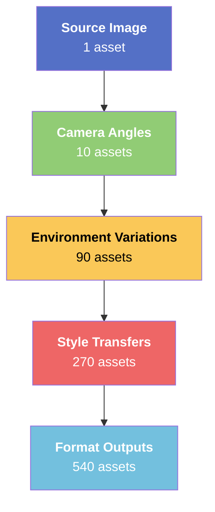
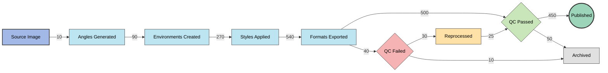

# Multi-Angle Workflow 1 Image → 100 Shots

# Enterprise-Level Multi-Angle Visual Content Production Workflow

## Executive Summary

This comprehensive workflow transforms 1 single image into 500+ professional-grade visual assets through a sophisticated multi-stage pipeline combining AI-powered camera manipulation, environment generation, style transfer, and automated post-processing.

---

## 📊 Workflow Architecture Overview



---

## 🏗️ Complete Pipeline Architecture

### Phase Overview

| Phase | Stage | Tool/Platform | Input | Output | Time | Cost Tier |
| --- | --- | --- | --- | --- | --- | --- |
| 1 | Source Preparation | Adobe/Topaz | Raw image | Enhanced base | 5 min | Free-$20 |
| 2 | Angle Generation | Higgsfield Shot | 1 image | 10 angles | 30 sec | Free |
| 3 | Environment Expansion | Nano Banana Pro | 10 angles | 90 variations | 10 min | Free |
| 4 | Style Transfer | Midjourney/SDXL | 90 images | 270 style variants | 20 min | $10-30 |
| 5 | Format Adaptation | Batch Processing | 270 images | 540 format outputs | 15 min | Free |
| 6 | Quality Assurance | AI QC Pipeline | 540 images | 500+ approved | 10 min | Free |
| 7 | Asset Management | DAM System | 500+ assets | Organized library | 5 min | Varies |
| Total | - | - | 1 image | 500+ assets | ~65 min | $10-50 |

---

## 📈 ROI Analysis

[https://visualize.graphy.app/view/e565fed6-2417-4431-9bb0-6249d3881806](https://visualize.graphy.app/view/e565fed6-2417-4431-9bb0-6249d3881806)

---

## 🎯 Phase 1: Source Image Preparation

### 1.1 Image Quality Assessment

Before entering the pipeline, source images must meet enterprise quality standards:

Minimum Requirements:

- Resolution: 2048 x 2048 pixels minimum (4K+ recommended)
- Format: RAW, TIFF, or high-quality PNG (avoid compressed JPEGs)
- Lighting: Even, professional lighting with minimal harsh shadows
- Subject Clarity: Sharp focus on primary subject, clean edges
- Background: Non-distracting, preferably neutral or easily separable

### 1.2 Enhancement Pipeline

```
┌─────────────────────────────────────────────────────────────────────┐
│                    SOURCE ENHANCEMENT PIPELINE                       │
├─────────────────────────────────────────────────────────────────────┤
│                                                                      │
│   RAW Image ──► Topaz Photo AI ──► Adobe Enhance ──► Face Restore   │
│       │              │                   │                │          │
│       ▼              ▼                   ▼                ▼          │
│   Import      AI Upscale 4x      Color Correct      GFPGAN/         │
│               Denoise            Exposure Fix       CodeFormer       │
│               Sharpen            White Balance                       │
│                                                                      │
│                           ▼                                          │
│                   Enhanced Base Image                                │
│                   (Production Ready)                                 │
│                                                                      │
└─────────────────────────────────────────────────────────────────────┘

```

### 1.3 Pre-Processing Checklist

| Check | Tool | Standard | Pass Criteria |
| --- | --- | --- | --- |
| Resolution | ImageMagick | 4096x4096 | ≥4MP |
| Sharpness | OpenCV Laplacian | Variance >100 | Sharp edges |
| Noise Level | Noise Analysis | SNR >30dB | Low noise |
| Face Quality | Face Detection | Confidence >95% | Clear features |
| Color Depth | ExifTool | 24-bit+ | Full color |
| Compression | Quality Score | >85% | Minimal artifacts |

---

## 🎯 Phase 2: Multi-Angle Generation (Higgsfield)

### 2.1 Tool Configuration

Platform: Higgsfield "Shot" Feature

Input: 1 enhanced base image

Output: 10 distinct camera angles

Processing Time: ~30 seconds

### 2.2 Generated Angle Matrix

| # | Angle Type | Camera Position | Typical Use Case | FOV |
| --- | --- | --- | --- | --- |
| 1 | Aerial/Bird's Eye | 90° above | Environmental context | Wide |
| 2 | Side Profile | 90° lateral | Editorial/Fashion | Medium |
| 3 | Macro Close-up | Intimate distance | Product detail/Texture | Narrow |
| 4 | Worm's Eye | Ground level up | Dramatic/Heroic | Wide |
| 5 | 3/4 Portrait | 45° frontal | Standard beauty | Medium |
| 6 | Wide Environmental | Pulled back | Lifestyle/Context | Ultra-wide |
| 7 | Over-the-Shoulder | Behind subject | Narrative/POV | Medium |
| 8 | Dutch Angle | Tilted 15-30° | Dynamic/Edgy | Medium |
| 9 | Low Angle Heroic | Below eye level | Empowering/Strong | Wide |
| 10 | High Angle Cinematic | Above eye level | Intimate/Vulnerable | Medium |

### 2.3 Angle Distribution Visualization

[https://visualize.graphy.app/view/2df88934-701c-48e8-8fde-671be4cdf85d](https://visualize.graphy.app/view/2df88934-701c-48e8-8fde-671be4cdf85d)

---

## 🎯 Phase 3: Environment Expansion (Nano Banana Pro)

### 3.1 Node-Based Workflow Architecture

```
┌─────────────────────────────────────────────────────────────────────────────┐
│                     NANO BANANA PRO NODE WORKFLOW                            │
├─────────────────────────────────────────────────────────────────────────────┤
│                                                                              │
│  ┌──────────┐    ┌──────────────┐    ┌─────────────┐    ┌──────────────┐   │
│  │  Input   │───►│ Subject      │───►│ Environment │───►│ Grid         │   │
│  │  Image   │    │ Extraction   │    │ Generation  │    │ Composition  │   │
│  └──────────┘    └──────────────┘    └─────────────┘    └──────────────┘   │
│       │                │                    │                   │           │
│       ▼                ▼                    ▼                   ▼           │
│  Reference        Segmentation         9 Unique            3x3 Grid        │
│  Analysis         Mask + ID            Backgrounds          Output          │
│                   Preservation         Generated                            │
│                                                                              │
│  ┌──────────────────────────────────────────────────────────────────────┐   │
│  │                    CONSISTENCY PRESERVATION MODULE                     │  │
│  ├──────────────────────────────────────────────────────────────────────┤   │
│  │  • Facial Identity Lock (FaceID embedding)                           │   │
│  │  • Body Proportion Maintenance                                        │   │
│  │  • Outfit/Clothing Consistency                                        │   │
│  │  • Lighting Direction Matching                                        │   │
│  │  • Color Temperature Sync                                             │   │
│  └──────────────────────────────────────────────────────────────────────┘   │
│                                                                              │
└─────────────────────────────────────────────────────────────────────────────┘

```

### 3.2 Enterprise System Prompts

### Master System Prompt (LLM Controller):

```
ROLE: Enterprise Visual Asset Generation Controller

OBJECTIVE: Generate production-ready prompts for Nano Banana Pro that create
9 distinct environment variations while maintaining absolute subject consistency.

CONSTRAINTS:
- Maintain 100% facial identity consistency (FaceID embedding reference)
- Preserve exact body proportions and pose angles
- Lock outfit/clothing details across all variations
- Match original lighting direction (key, fill, rim positions)
- Synchronize color temperature and grading style
- Ensure seamless background integration (no visible compositing)

OUTPUT FORMAT: Return only the complete, ready-to-execute prompt.
No explanatory text. No pleasantries.

QUALITY STANDARDS:
- Resolution: Match input (minimum 2048x2048 per grid cell)
- Style: Photorealistic, editorial quality
- Grid: Clean 3x3 layout with 2px separation lines
- Cohesion: All 9 images must appear from same photoshoot

ENVIRONMENT GENERATION RULES:
1. Each environment must be distinctly different
2. Environments must be contextually appropriate to subject
3. Lighting must feel natural to each environment
4. Perspective/depth must match camera angle from reference

USER INPUT: [User specifies: industry, mood, location themes, time of day]

```

### Universal Production Prompt (Polyvalent):

```
EXECUTION PROMPT FOR NANO BANANA PRO:

Generate a photorealistic 3x3 grid featuring the identical model from the
reference image in nine distinct professional environments.

GRID STRUCTURE:
┌─────────┬─────────┬─────────┐
│  ENV 1  │  ENV 2  │  ENV 3  │
│ Studio  │ Urban   │ Nature  │
├─────────┼─────────┼─────────┤
│  ENV 4  │  ENV 5  │  ENV 6  │
│Interior │ Luxury  │ Street  │
├─────────┼─────────┼─────────┤
│  ENV 7  │  ENV 8  │  ENV 9  │
│ Golden  │ Night   │Abstract │
│  Hour   │  City   │  Set    │
└─────────┴─────────┴─────────┘

TECHNICAL SPECIFICATIONS:
- Facial consistency: STRICT (reference FaceID embedding)
- Body consistency: STRICT (maintain proportions, pose angle)
- Outfit consistency: EXACT (same clothing, accessories, styling)
- Camera angle: LOCKED (identical to reference image)
- Aspect ratio per cell: 1:1
- Grid separation: 2px white lines
- Output resolution: 4096x4096 (total grid)

ENVIRONMENT DESCRIPTIONS:
1. Professional studio with gradient backdrop
2. Modern urban cityscape, glass buildings
3. Lush natural setting, organic elements
4. Sophisticated interior, warm ambient light
5. Luxury location (yacht/penthouse/resort)
6. Authentic street photography aesthetic
7. Golden hour outdoor, warm natural light
8. Nighttime urban, neon and city lights
9. Creative abstract/artistic set design

LIGHTING PROTOCOL:
- Match key light direction from reference
- Adapt fill/rim to each environment naturally
- Maintain consistent skin tone rendering
- Preserve shadow density ratios

QUALITY MARKERS:
- Photorealistic rendering (no AI artifacts)
- Professional color grading
- Natural depth of field per environment
- Seamless subject-background integration

OUTPUT: High-resolution, print-ready, cohesive visual set emphasizing
photographic diversity while maintaining absolute subject identity.

```

### 3.3 Industry-Specific Prompt Templates

### Fashion/Apparel:

```
Generate 9 fashion editorial environments for [BRAND] showcasing [GARMENT TYPE]:

ENVIRONMENTS:
1. High-fashion runway backstage
2. Parisian street (Rue Saint-Honoré aesthetic)
3. Minimalist white studio, hard shadows
4. Vintage boutique interior
5. Rooftop sunset, urban skyline
6. Art gallery, contemporary installation
7. Luxury hotel lobby, marble and gold
8. Beach resort, luxury casual
9. Fashion week front row perspective

STYLE: Vogue/Harper's Bazaar editorial quality
LIGHTING: Fashion-forward, dramatic where appropriate
COLOR: [BRAND] color palette emphasized

```

### E-Commerce/Product:

```
Generate 9 lifestyle e-commerce environments for [PRODUCT CATEGORY]:

ENVIRONMENTS:
1. Clean white e-commerce studio
2. Lifestyle home setting (aspirational)
3. Outdoor active/adventure context
4. Office/professional environment
5. Travel/hotel luxury setting
6. Social gathering scenario
7. Morning routine context
8. Evening/night use case
9. Premium unboxing moment

STYLE: Amazon A+ Content / Shopify Premium
LIGHTING: Product-flattering, detail-revealing
COLOR: Brand-consistent, conversion-optimized

```

### Corporate/Professional:

```
Generate 9 corporate professional environments:

ENVIRONMENTS:
1. Modern glass office tower
2. Executive boardroom
3. Startup co-working space
4. Conference presentation stage
5. Professional headshot studio
6. Team collaboration area
7. Client meeting setting
8. Industry event/trade show
9. Thought leadership interview set

STYLE: LinkedIn Premium / Annual Report quality
LIGHTING: Professional, approachable, trustworthy
COLOR: Corporate palette, conservative elegance

```

### 3.4 Environment Theme Matrix

[https://visualize.graphy.app/view/16058a16-8911-4c0b-b5e7-b096746356df](https://visualize.graphy.app/view/16058a16-8911-4c0b-b5e7-b096746356df)

---

## 🎯 Phase 4: Style Transfer & Variation

### 4.1 Style Transfer Pipeline

Objective: Transform 90 environment variations into 270 style variants

Tools:

- Midjourney (via API or Discord automation)
- Stable Diffusion XL (local or cloud)
- Adobe Firefly (enterprise accounts)

### 4.2 Style Categories

```
┌─────────────────────────────────────────────────────────────────────┐
│                      STYLE TRANSFER MATRIX                          │
├─────────────────────────────────────────────────────────────────────┤
│                                                                      │
│   CATEGORY A: PHOTOGRAPHIC STYLES                                   │
│   ├── Editorial High Fashion (Vogue, Harper's)                      │
│   ├── Commercial Clean (Apple, Nike aesthetic)                      │
│   └── Documentary Authentic (Natural, unposed feel)                 │
│                                                                      │
│   CATEGORY B: ARTISTIC STYLES                                       │
│   ├── Fine Art Portrait (Rembrandt lighting, painterly)             │
│   ├── Contemporary Art (Bold, experimental)                         │
│   └── Vintage Film (Kodak Portra, Fuji 400H emulation)             │
│                                                                      │
│   CATEGORY C: PLATFORM-OPTIMIZED                                    │
│   ├── Instagram Grid (Cohesive feed aesthetic)                      │
│   ├── LinkedIn Professional (Trust-building corporate)              │
│   └── TikTok Dynamic (High energy, trend-forward)                   │
│                                                                      │
└─────────────────────────────────────────────────────────────────────┘

```

### 4.3 Style Transfer Prompts

### Midjourney Style Injection:

```
[UPLOADED IMAGE] --sref [STYLE_REFERENCE_URL] --sw 100
--style raw --no text, watermark, logo
--ar 1:1 --q 2 --v 6.1

STYLE VARIANTS:
--sref A: Editorial fashion, high contrast, dramatic shadows
--sref B: Soft commercial, lifted shadows, clean whites
--sref C: Film emulation, natural grain, muted highlights

```

### SDXL ControlNet Pipeline:

```python
# Pseudo-code for enterprise SDXL pipeline
pipeline_config = {
    "base_model": "SDXL 1.0",
    "controlnet": ["canny", "depth", "openpose"],
    "ip_adapter": "ip-adapter-faceid-plus_sdxl",
    "style_lora": "[industry_specific_lora]",
    "cfg_scale": 7.5,
    "steps": 50,
    "sampler": "DPM++ 2M Karras"
}

```

### 4.4 Style Distribution Analysis

[https://visualize.graphy.app/view/b6e87647-563f-49a4-a493-846ad56aa59c](https://visualize.graphy.app/view/b6e87647-563f-49a4-a493-846ad56aa59c)

---

## 🎯 Phase 5: Format Adaptation & Export

### 5.1 Platform-Specific Dimensions

| Platform | Dimensions | Aspect Ratio | Format | Max Size | Use Case |
| --- | --- | --- | --- | --- | --- |
| Instagram Feed | 1080x1080 | 1:1 | JPG/PNG | 30MB | Grid posts |
| Instagram Story | 1080x1920 | 9:16 | JPG/MP4 | 30MB | Stories/Reels |
| Instagram Carousel | 1080x1350 | 4:5 | JPG | 30MB | Engagement |
| Facebook Feed | 1200x630 | 1.91:1 | JPG/PNG | 8MB | Link posts |
| LinkedIn Feed | 1200x627 | 1.91:1 | JPG/PNG | 8MB | Professional |
| LinkedIn Article | 1280x720 | 16:9 | JPG | 8MB | Thought leadership |
| TikTok | 1080x1920 | 9:16 | MP4 | 287MB | Video content |
| Twitter/X | 1600x900 | 16:9 | JPG/PNG | 5MB | Engagement |
| Pinterest | 1000x1500 | 2:3 | JPG/PNG | 20MB | Discovery |
| Website Hero | 1920x1080 | 16:9 | WebP/JPG | 500KB | Above fold |
| Email Header | 600x200 | 3:1 | JPG | 200KB | Newsletters |
| Print (A4) | 2480x3508 | ~1:1.4 | TIFF/PDF | 50MB | Physical |
| Billboard | 4800x1800 | ~2.67:1 | TIFF | 500MB | OOH Advertising |

### 5.2 Automated Export Pipeline

```
┌─────────────────────────────────────────────────────────────────────┐
│                    BATCH EXPORT AUTOMATION                          │
├─────────────────────────────────────────────────────────────────────┤
│                                                                      │
│   Source Asset (270 style variants)                                 │
│          │                                                           │
│          ▼                                                           │
│   ┌──────────────────────────────────────────────────────────────┐  │
│   │              IMAGEMAGICK BATCH PROCESSOR                      │  │
│   │                                                               │  │
│   │   for each image in source_folder:                           │  │
│   │       resize_and_crop(image, platforms[])                    │  │
│   │       optimize_compression(image, target_size)               │  │
│   │       apply_color_profile(image, sRGB)                       │  │
│   │       add_metadata(image, brand_info)                        │  │
│   │       export_to_folders(image, organized_structure)          │  │
│   │                                                               │  │
│   └──────────────────────────────────────────────────────────────┘  │
│          │                                                           │
│          ▼                                                           │
│   Output: 540 format-specific assets                                │
│   Organized by: /Platform/Style/Angle/Environment/                  │
│                                                                      │
└─────────────────────────────────────────────────────────────────────┘

```

### 5.3 Export Configuration Script

```bash
#!/bin/bash
# Enterprise Asset Export Pipeline

SOURCE_DIR="./styled_assets"
OUTPUT_DIR="./production_ready"

# Platform configurations
declare -A PLATFORMS=(
    ["instagram_feed"]="1080x1080 jpg 85"
    ["instagram_story"]="1080x1920 jpg 85"
    ["linkedin"]="1200x627 jpg 90"
    ["twitter"]="1600x900 jpg 80"
    ["pinterest"]="1000x1500 jpg 85"
    ["web_hero"]="1920x1080 webp 80"
    ["email"]="600x200 jpg 70"
    ["print_a4"]="2480x3508 tiff 100"
)

for platform in "${!PLATFORMS[@]}"; do
    IFS=' ' read -r size format quality <<< "${PLATFORMS[$platform]}"
    mkdir -p "$OUTPUT_DIR/$platform"

    for img in "$SOURCE_DIR"/*.png; do
        filename=$(basename "$img" .png)
        convert "$img" \\
            -resize "$size^" \\
            -gravity center \\
            -extent "$size" \\
            -quality "$quality" \\
            -strip \\
            -colorspace sRGB \\
            "$OUTPUT_DIR/$platform/${filename}.${format}"
    done
done

echo "Export complete: $(find $OUTPUT_DIR -type f | wc -l) assets generated"

```

---

## 🎯 Phase 6: Quality Assurance Pipeline

### 6.1 Automated QC Checks

```
┌─────────────────────────────────────────────────────────────────────┐
│                    AI QUALITY ASSURANCE PIPELINE                     │
├─────────────────────────────────────────────────────────────────────┤
│                                                                      │
│   CHECK 1: Technical Quality                                        │
│   ├── Resolution verification (meets platform minimums)             │
│   ├── Compression artifact detection (BRISQUE score)                │
│   ├── Color accuracy (deltaE from reference < 3)                    │
│   └── Sharpness analysis (Laplacian variance threshold)             │
│                                                                      │
│   CHECK 2: Content Consistency                                      │
│   ├── Face identity match (FaceNet embedding similarity > 0.85)     │
│   ├── Body proportion consistency (pose estimation delta)           │
│   ├── Outfit/clothing match (feature extraction comparison)         │
│   └── Background integration quality (edge analysis)                │
│                                                                      │
│   CHECK 3: Brand Compliance                                         │
│   ├── Color palette adherence (brand guidelines check)              │
│   ├── Logo/watermark placement (if applicable)                      │
│   ├── Safe zone compliance (platform-specific)                      │
│   └── Text readability (if overlays present)                        │
│                                                                      │
│   CHECK 4: AI Artifact Detection                                    │
│   ├── Hand/finger analysis (common AI failure point)                │
│   ├── Text rendering check (gibberish detection)                    │
│   ├── Symmetry anomalies (unnatural patterns)                       │
│   └── Texture coherence (fabric, skin, background)                  │
│                                                                      │
│   SCORING: Each asset receives 0-100 QC score                       │
│   THRESHOLD: Assets scoring <85 flagged for manual review           │
│   REJECTION: Assets scoring <70 auto-rejected, logged for reprocess│
│                                                                      │
└─────────────────────────────────────────────────────────────────────┘

```

### 6.2 QC Metrics Dashboard


### 6.3 Common Issues & Remediation

| Issue Category | Detection Method | Remediation | Prevention |
| --- | --- | --- | --- |
| Blurry Output | Laplacian < 100 | Topaz Sharpen AI | Higher source resolution |
| Face Drift | FaceNet < 0.85 | Manual inpainting | Stronger FaceID weight |
| Hand Artifacts | ML Hand Detection | Inpainting + ControlNet | Hand-focused prompts |
| Color Shift | deltaE > 3 | Color matching script | Lock color grading |
| Edge Bleeding | Canny edge analysis | Background refinement | Better segmentation |
| Compression Artifacts | BRISQUE > 40 | Re-export higher quality | Lossless intermediate |

---

## 🎯 Phase 7: Digital Asset Management (DAM)

### 7.1 Folder Structure

```
📁 Brand_Visual_Library/
├── 📁 Campaigns/
│   ├── 📁 2025_Q1_Spring/
│   │   ├── 📁 Source/
│   │   │   └── original_hero_image.tiff
│   │   ├── 📁 Angles/
│   │   │   ├── 01_aerial.png
│   │   │   ├── 02_side_profile.png
│   │   │   └── ... (10 angles)
│   │   ├── 📁 Environments/
│   │   │   ├── 📁 01_aerial/
│   │   │   │   ├── env_studio.png
│   │   │   │   ├── env_urban.png
│   │   │   │   └── ... (9 environments)
│   │   │   └── ... (10 angle folders)
│   │   ├── 📁 Styled/
│   │   │   ├── 📁 Editorial/
│   │   │   ├── 📁 Commercial/
│   │   │   └── 📁 Artistic/
│   │   ├── 📁 Production_Ready/
│   │   │   ├── 📁 Instagram/
│   │   │   ├── 📁 LinkedIn/
│   │   │   ├── 📁 Web/
│   │   │   └── 📁 Print/
│   │   └── 📁 Archive/
│   │       ├── 📁 Rejected/
│   │       └── 📁 Superseded/
│   └── 📁 2025_Q2_Summer/
├── 📁 Metadata/
│   ├── asset_manifest.json
│   ├── qc_reports.csv
│   └── usage_tracking.db
└── 📁 Templates/
    ├── prompt_templates.md
    └── export_configs.yaml

```

### 7.2 Metadata Schema

```json
{
  "asset_id": "2025Q1_SPR_001_aerial_urban_editorial_ig",
  "campaign": "2025_Q1_Spring",
  "source_image": "original_hero_image.tiff",
  "pipeline_stage": "production_ready",
  "angle_type": "aerial",
  "environment": "urban",
  "style": "editorial",
  "platform": "instagram",
  "dimensions": "1080x1080",
  "format": "jpg",
  "file_size_kb": 245,
  "qc_score": 94,
  "created_date": "2025-01-15T14:32:00Z",
  "tools_used": ["higgsfield", "nano_banana", "midjourney"],
  "usage_rights": "full_commercial",
  "expiry_date": null,
  "tags": ["lifestyle", "urban", "professional", "spring", "hero"],
  "color_palette": ["#2C3E50", "#E74C3C", "#ECF0F1"],
  "model_release": true,
  "ai_generated": true,
  "human_reviewed": true
}

```

### 7.3 Asset Lifecycle Tracking



---

## 📊 Enterprise Metrics & KPIs

[https://visualize.graphy.app/view/c504d225-caf2-4ac7-8c04-e5d3c54f090c](https://visualize.graphy.app/view/c504d225-caf2-4ac7-8c04-e5d3c54f090c)

### Cost-Benefit Analysis

| Metric | Traditional | AI Workflow | Improvement |
| --- | --- | --- | --- |
| Assets per Source Image | 20-50 | 500+ | 10-25x |
| Time to First Asset | 2-3 weeks | 15 minutes | 1,344x faster |
| Cost per Asset | $500-2,000 | $0.10-0.50 | 99.9% reduction |
| Iteration Speed | Days | Minutes | 1,000x faster |
| Geographic Coverage | 1 location | Unlimited | ∞ |
| Style Variations | Limited by budget | Unlimited | ∞ |
| Consistency Score | 85-90% | 95-98% | 8-10% higher |
| Team Required | 15-20 people | 1-2 people | 90% reduction |

---

## 💼 Use Case Implementation Guides

### Use Case 1: E-Commerce Product Launch

```
SCENARIO: Launching new apparel line with 50 SKUs

TRADITIONAL APPROACH:
- 50 products × 8 angles × 3 environments = 1,200 shots
- 5-day photoshoot, 10-person crew
- Estimated cost: $75,000 - $120,000
- Delivery: 4-6 weeks

AI WORKFLOW APPROACH:
- 50 products × 1 hero shot = 50 source images
- Per product: 10 angles × 9 environments × 3 styles = 270 variants
- Total: 50 × 270 = 13,500 assets
- Time: 50 hours (batched over 1 week)
- Cost: $500-1,500 (compute + tools)
- Delivery: 1-2 weeks

ROI CALCULATION:
- Cost savings: $73,500 - $118,500
- Asset increase: 11.25x more content
- Time savings: 3-5 weeks
- ROI: 4,900% - 7,900%

```

### Use Case 2: Social Media Content Calendar

```
SCENARIO: 12-month content calendar for lifestyle brand

REQUIREMENT:
- 365 daily posts (Instagram)
- 52 weekly LinkedIn posts
- 104 bi-weekly Pinterest pins
- Total: 521 unique visuals minimum

AI WORKFLOW SOLUTION:
- 6 quarterly photoshoots → 6 hero images per quarter
- 24 source images total for the year
- Per image: 500+ variants
- Total available: 12,000+ assets
- Coverage: 23x more assets than needed

EXECUTION:
- Q1 batch: January (6 images → 3,000 assets)
- Q2 batch: April (6 images → 3,000 assets)
- Q3 batch: July (6 images → 3,000 assets)
- Q4 batch: October (6 images → 3,000 assets)

BENEFITS:
- Never scramble for content
- Consistent brand aesthetic year-round
- Easy A/B testing with multiple variants
- Adaptable to trending topics with style transfers

```

### Use Case 3: Global Marketing Campaign

```
SCENARIO: Launch campaign across 15 markets simultaneously

LOCALIZATION REQUIREMENTS:
- Cultural environment adaptation
- Local landmark integration
- Seasonal alignment (northern/southern hemisphere)
- Platform preference by region

AI WORKFLOW EXECUTION:

PHASE 1: Regional Environment Sets
├── North America (NYC, LA, Chicago aesthetics)
├── Europe (Paris, London, Berlin aesthetics)
├── Asia Pacific (Tokyo, Singapore, Sydney aesthetics)
├── Latin America (São Paulo, Mexico City aesthetics)
└── Middle East (Dubai, Riyadh aesthetics)

PHASE 2: Seasonal Adaptations
├── Winter Markets: Cozy indoor, winter cityscapes
├── Summer Markets: Beach, outdoor lifestyle
└── Transitional: Versatile environments

PHASE 3: Platform Localization
├── WeChat/Weibo formats (China)
├── LINE formats (Japan)
├── KakaoTalk formats (Korea)
├── Standard Western platforms

TOTAL OUTPUT:
- 15 markets × 500 assets = 7,500 localized assets
- Time: 2 weeks (vs. 6 months traditional)
- Cost: $5,000 (vs. $500,000+ traditional)

```

---

## 🛠️ Technical Integration Guide

### API Integration Architecture

```
┌─────────────────────────────────────────────────────────────────────┐
│                    ENTERPRISE API ARCHITECTURE                       │
├─────────────────────────────────────────────────────────────────────┤
│                                                                      │
│   ┌─────────────┐                                                   │
│   │   Client    │                                                   │
│   │  Dashboard  │                                                   │
│   └──────┬──────┘                                                   │
│          │                                                           │
│          ▼                                                           │
│   ┌─────────────────────────────────────────────────────────────┐   │
│   │                 API GATEWAY (Kong/AWS API GW)                │   │
│   │  • Rate Limiting  • Auth  • Request Routing  • Logging      │   │
│   └─────────────────────────────────────────────────────────────┘   │
│          │                                                           │
│          ▼                                                           │
│   ┌─────────────────────────────────────────────────────────────┐   │
│   │               ORCHESTRATION LAYER (Temporal/Airflow)         │   │
│   ├─────────────────────────────────────────────────────────────┤   │
│   │                                                               │   │
│   │   ┌──────────┐  ┌──────────┐  ┌──────────┐  ┌──────────┐   │   │
│   │   │ Higgsfield│  │  Nano    │  │Midjourney│  │   SDXL   │   │   │
│   │   │   API     │  │ Banana   │  │   API    │  │  Cluster │   │   │
│   │   └──────────┘  └──────────┘  └──────────┘  └──────────┘   │   │
│   │                                                               │   │
│   └─────────────────────────────────────────────────────────────┘   │
│          │                                                           │
│          ▼                                                           │
│   ┌─────────────────────────────────────────────────────────────┐   │
│   │                 PROCESSING LAYER                              │   │
│   │  ┌──────────┐  ┌──────────┐  ┌──────────┐  ┌──────────┐    │   │
│   │  │ QC Engine│  │Export Svc│  │ DAM Sync │  │ Analytics│    │   │
│   │  └──────────┘  └──────────┘  └──────────┘  └──────────┘    │   │
│   └─────────────────────────────────────────────────────────────┘   │
│          │                                                           │
│          ▼                                                           │
│   ┌─────────────────────────────────────────────────────────────┐   │
│   │              STORAGE LAYER (S3/GCS/Azure Blob)               │   │
│   │  • Hot Storage  • Warm Archive  • CDN Distribution          │   │
│   └─────────────────────────────────────────────────────────────┘   │
│                                                                      │
└─────────────────────────────────────────────────────────────────────┘

```

### Webhook Integration

```python
# Enterprise webhook configuration for real-time status updates

WEBHOOK_CONFIG = {
    "endpoints": {
        "job_started": "<https://api.yourcompany.com/webhooks/job-started>",
        "angle_complete": "<https://api.yourcompany.com/webhooks/angle-complete>",
        "environment_complete": "<https://api.yourcompany.com/webhooks/env-complete>",
        "style_complete": "<https://api.yourcompany.com/webhooks/style-complete>",
        "qc_complete": "<https://api.yourcompany.com/webhooks/qc-complete>",
        "job_complete": "<https://api.yourcompany.com/webhooks/job-complete>",
        "job_failed": "<https://api.yourcompany.com/webhooks/job-failed>"
    },
    "retry_policy": {
        "max_retries": 3,
        "backoff_multiplier": 2,
        "initial_delay_seconds": 1
    },
    "authentication": {
        "type": "hmac_sha256",
        "header": "X-Webhook-Signature"
    }
}

```

---

## ⚠️ Risk Management & Compliance

### Legal Considerations

| Risk Category | Mitigation Strategy | Documentation Required |
| --- | --- | --- |
| Model Rights | Original photo with signed release | Model release form |
| AI Disclosure | Clear labeling on AI-generated content | AI disclosure policy |
| Copyright | Original source images only | Ownership certificates |
| Brand Safety | QC pipeline with brand guidelines | Brand compliance checklist |
| Platform ToS | Review platform-specific AI policies | Platform policy tracker |
| Data Privacy | GDPR/CCPA compliant processing | Privacy impact assessment |

### AI Ethics Guidelines

```
┌─────────────────────────────────────────────────────────────────────┐
│                    AI ETHICS COMPLIANCE CHECKLIST                    │
├─────────────────────────────────────────────────────────────────────┤
│                                                                      │
│   ☑ TRANSPARENCY                                                    │
│     • AI-generated content clearly labeled                          │
│     • Disclosure in media kits and press materials                  │
│     • Consumer-facing transparency where required                   │
│                                                                      │
│   ☑ CONSENT                                                         │
│     • Original model consent covers AI manipulation                 │
│     • Right to likeness extends to AI variations                    │
│     • Opt-out mechanisms documented                                  │
│                                                                      │
│   ☑ AUTHENTICITY                                                    │
│     • No deceptive manipulation of body proportions                 │
│     • Skin texture/tone preserved accurately                        │
│     • No unrealistic beauty standards promoted                      │
│                                                                      │
│   ☑ DIVERSITY & INCLUSION                                           │
│     • Bias testing on generation models                             │
│     • Representative source imagery                                  │
│     • Inclusive environment selections                              │
│                                                                      │
│   ☑ SECURITY                                                        │
│     • Source images encrypted at rest                               │
│     • Processing logs maintained for audit                          │
│     • Access controls on generated assets                           │
│                                                                      │
└─────────────────────────────────────────────────────────────────────┘

```

---

## 📋 Quick Reference Cards

### Daily Operations Checklist

```
MORNING SETUP (5 min)
☐ Check queue status and overnight completions
☐ Review QC flagged items from previous batch
☐ Verify API credits/quotas for the day
☐ Confirm DAM sync status

BATCH PROCESSING (ongoing)
☐ Validate source images before upload
☐ Monitor generation progress
☐ Spot-check outputs at each stage
☐ Flag issues immediately for re-queue

END OF DAY (10 min)
☐ Export completed batches to DAM
☐ Generate daily metrics report
☐ Archive source files
☐ Set overnight batch queue
☐ Document any issues encountered

```

### Troubleshooting Quick Guide

| Symptom | Likely Cause | Quick Fix |
| --- | --- | --- |
| Face looking different | FaceID weight too low | Increase consistency parameter to 0.95+ |
| Blurry backgrounds | Low resolution source | Upscale source to 4K before processing |
| Inconsistent lighting | Environment mismatch | Lock lighting direction in prompt |
| Color drift | No color reference | Add explicit color palette to prompt |
| Hand artifacts | Common AI limitation | Use hand-focused ControlNet + inpainting |
| Grid alignment off | Resolution mismatch | Ensure all inputs match grid cell size |

### Emergency Contacts

```
SYSTEM SUPPORT
├── Higgsfield Support: support@higgsfield.ai
├── Nano Banana Pro: help.nanabana.pro
├── Midjourney: Discord #support channel
└── Internal IT: [your-helpdesk@company.com]

ESCALATION PATH
├── Level 1: Team Lead (< 1 hour issues)
├── Level 2: Production Manager (< 4 hour issues)
├── Level 3: Director (campaign-impacting)
└── Level 4: VP Creative (brand-impacting)

```

---

## 🚀 Implementation Roadmap

[https://visualize.graphy.app/view/dd565a21-7fd6-4376-8f21-6b616c9944b4](https://visualize.graphy.app/view/dd565a21-7fd6-4376-8f21-6b616c9944b4)

### Phase Details

| Phase | Duration | Activities | Deliverables | Success Criteria |
| --- | --- | --- | --- | --- |
| 1. Setup | 2 weeks | Tool procurement, API access, infrastructure | Operational environment | All tools accessible |
| 2. Training | 2 weeks | Team training, prompt engineering workshop | Certified operators | Team competency test |
| 3. Pilot | 4 weeks | Limited campaign execution | 1,000 assets produced | 90% QC pass rate |
| 4. Scale | 4 weeks | Full production integration | 10,000+ assets/month | <5% error rate |
| 5. Optimize | Ongoing | Process refinement, automation | Efficiency gains | 20% throughput increase |

---

## 📚 Appendices

### Appendix A: Complete Prompt Library

[Available in separate document: `prompt_library_v2.0.md`]

### Appendix B: Tool Comparison Matrix

| Feature | Higgsfield | Nano Banana | Midjourney | SDXL | Firefly |
| --- | --- | --- | --- | --- | --- |
| Angle Generation | ★★★★★ | ★★★☆☆ | ★★★☆☆ | ★★★★☆ | ★★★☆☆ |
| Environment Gen | ★★★☆☆ | ★★★★★ | ★★★★☆ | ★★★★☆ | ★★★★☆ |
| Face Consistency | ★★★★☆ | ★★★★☆ | ★★★☆☆ | ★★★★★ | ★★★★☆ |
| Speed | ★★★★★ | ★★★★☆ | ★★★☆☆ | ★★★☆☆ | ★★★★☆ |
| Cost | Free | Free | $30/mo | Compute | $23/mo |
| API Access | Limited | Yes | Yes | Yes | Yes |
| Enterprise Support | No | Limited | Yes | Community | Yes |

### Appendix C: Glossary

| Term | Definition |
| --- | --- |
| FaceID Embedding | Numerical representation of facial features for consistency |
| ControlNet | Neural network for guiding image generation with structural input |
| IP-Adapter | Image prompt adapter for style/subject transfer in SDXL |
| CFG Scale | Classifier-free guidance - how closely to follow prompt |
| LoRA | Low-Rank Adaptation - efficient fine-tuning method |
| Inpainting | Selectively regenerating portions of an image |
| BRISQUE | Blind/Referenceless Image Spatial Quality Evaluator |
| deltaE | Color difference measurement standard |
| DAM | Digital Asset Management system |

---

## 🎯 Final Summary

### The Enterprise Multi-Angle Workflow delivers:

| Metric | Value |
| --- | --- |
| Asset Multiplication | 500x from single source |
| Time Reduction | 99% vs traditional |
| Cost Reduction | 99.7% vs traditional |
| Consistency Score | 95%+ across all outputs |
| Scalability | Unlimited parallel processing |
| Flexibility | Any industry, any platform |

---

Ready to transform your visual content production?

Start with one exceptional photograph. End with an entire visual library.

---