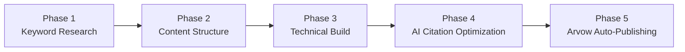

# Claude SEO Content Engine — Full Strategy & Build Prompt

> **Purpose:** A complete blueprint for building a programmatic SEO content engine that ranks on Google **and** gets cited by AI systems (ChatGPT, Perplexity, Google AI Overviews, Gemini).
>
> **Based on:** A real case study that grew from near-zero to **1.7K monthly organic visits** with **215 pages** and a **DR of only 36**.

---

## Configuration

> [!IMPORTANT]
> Fill in these variables before executing any phase.

| Variable | Value |
|---|---|
| **Website URL** | `[INSERT YOUR WEBSITE URL]` |
| **Niche** | `[e.g. "a SaaS tool for accountants" or "a photography gear review site"]` |
| **Tech Stack** | `[e.g. Next.js, WordPress, Webflow, etc.]` |
| **Target Audience** | `[DESCRIBE YOUR BUSINESS AND TARGET AUDIENCE]` |
| **Monetization** | `[affiliate links / SaaS product / services / ads]` |
| **Publishing Cadence** | `[X] articles per week` |
| **Content Budget** | `[your budget]` |

---

## Phase 1 — Keyword Research Architecture

Generate a **master list of article topics** for your niche using the following proven templates:

### Topic Templates

| # | Template |
|---|---|
| 1 | `"Best [tool/product] for [my niche] in 2026"` |
| 2 | `"How to use [specific tool] for [specific outcome]"` |
| 3 | `"[Tool A] vs [Tool B]: Which is better for [use case]"` |
| 4 | `"[Tool name] review: Is it worth it in 2026?"` |
| 5 | `"Top [number] [category] tools for [audience]"` |
| 6 | `"[Tool] alternatives: Best options in 2026"` |
| 7 | `"Types of [concept in my niche] explained"` |
| 8 | `"[Trending topic in my niche]: Complete guide"` |

### Required Data per Topic

For each topic, generate:

1. **Primary keyword** — exact match, 100–2,000 monthly volume
2. **3–5 secondary keywords**
3. **Estimated search intent** — informational or commercial
4. **AI Overview citation likelihood** — tool comparisons and "best of" lists almost always qualify

---

## Phase 2 — Content Structure That Ranks & Gets AI-Cited

For each article, generate a **full content brief** with the following components:

### Article Brief Template

| Element | Specification |
|---|---|
| **Title** | Include year (2026), be specific, use the primary keyword |
| **Meta Description** | 150 chars max; include keyword + value proposition |
| **H1** | Match search intent exactly |
| **Intro** | 2–3 paragraphs. **Answer the question immediately in the first 40 words.** This is what AI systems pull as citations. |
| **Word Count** | 1,500–2,500 words (not more) |

### Content Body Requirements

- Use **H2s and H3s** for every subtopic
- Include a **comparison table** for any "best of" article
- Add a **"Quick Answer" box** at the top (AI systems love to cite these)
- Include **pros/cons** for every tool reviewed
- Add an **FAQ section** at the bottom targeting "People Also Ask"
- End with a **clear recommendation**

### Schema Markup

Generate JSON-LD schema for each article as applicable:

- `Article` schema
- `FAQ` schema
- `Review` schema *(if applicable)*
- `HowTo` schema *(if applicable)*

---

## Phase 3 — Technical Infrastructure

Create the following files and systems in your codebase:

### 1. `/scripts/generate-article.js`

A script that takes a **keyword + topic** and outputs a complete SEO-optimized article draft using the **Anthropic API** (`claude-sonnet-4-20250514`).

- Include a system prompt that enforces the content structure defined in Phase 2.

### 2. `/scripts/keyword-research.js`

A script that takes your **niche as input** and generates **50 article ideas** following the templates above.

**Output:** CSV with columns:

| Column | Description |
|---|---|
| `title` | Article title |
| `primary_keyword` | Target keyword |
| `secondary_keywords` | Comma-separated list |
| `intent` | `informational` or `commercial` |
| `ai_citation_potential` | High / Medium / Low |
| `priority_score` | 1–10 ranking |

### 3. `/sitemap-generator.js`

Auto-generates and updates `sitemap.xml` every time a new article is published.

### 4. `/scripts/internal-linking.js`

Scans all published articles and suggests internal links to add.

> [!TIP]
> Articles with more internal links rank better.

### 5. `/templates/article.html` *(or `.mdx` for Next.js)*

Pre-built template with:

- Schema markup slots (JSON-LD)
- Open Graph tags
- Canonical URL tag
- Reading time calculator
- Table of contents generator
- "Last updated" date *(important for freshness signals)*

---

## Phase 4 — AI Citation Optimization (The New SEO)

> [!IMPORTANT]
> This is what separates modern SEO from old SEO.

AI systems like ChatGPT and Perplexity scrape and cite pages that:

- ✅ Answer questions **directly and concisely** in the first paragraph
- ✅ Use **clear, structured formatting** (bullet points, numbered lists, tables)
- ✅ Have **authoritative-sounding but accessible** language
- ✅ Include **specific data, stats, or comparisons**
- ✅ Have **clear entity mentions** (tool names, brand names, proper nouns)

### AI Citation Scorer

Add a function to the article generator that:

1. **Scores** each article draft **1–10** on AI citation likelihood
2. **Provides specific rewrites** to improve the score

---

## Phase 5 — Auto-Publishing with Arvow Webhooks

Instead of manually publishing articles, use **[Arvow](https://arvow.com)** to auto-generate and auto-publish content directly to your website via their webhook system.

### How Arvow Webhooks Work

- Arvow **POSTs** a request to your custom endpoint every time a new article is published in your Arvow account
- Webhooks are **NOT retried** if they fail — the endpoint must be robust

### Webhook Payload

```json
{
  "id": "12345",
  "title": "Sample Title",
  "content": "<h2>example</h2><p>HTML version of the article</p>",
  "content_markdown": "## example\nMarkdown version of the article",
  "thumbnail": "https://example.com/sample-thumbnail.jpg",
  "thumbnail_alt_text": "Sample thumbnail description",
  "metadescription": "This is a sample meta description for SEO purposes.",
  "keyword_seed": "focus keyword",
  "language_code": "en"
}
```

### Files to Build

#### 1. `/api/arvow-webhook.js`

A webhook receiver endpoint that:

- Listens for **POST** requests from Arvow
- **Validates** the request using the Arvow integration secret key (stored as `ARVOW_SECRET` env var)
- **Parses** the payload fields: `id`, `title`, `content`, `content_markdown`, `thumbnail`, `thumbnail_alt_text`, `metadescription`, `keyword_seed`, `language_code`
- **Saves** the article to your CMS or database
- **Generates and injects** the correct JSON-LD schema markup based on content type
- **Updates** `sitemap.xml` automatically
- **Returns `200`** immediately to avoid Arvow timing out (offload heavy processing to a background job)
- **Logs failures** to `/logs/webhook-errors.log` so no publication is silently missed

#### 2. `/scripts/test-webhook.js`

A local test script that **simulates** an Arvow webhook POST to your endpoint so you can test the full pipeline without a live Arvow account.

#### 3. `.env.example`

```env
ARVOW_SECRET=your_arvow_integration_key_here
```

### Setup Instructions

| Step | Action |
|---|---|
| 1 | Sign up for Arvow at [https://arvow.com](https://arvow.com) |
| 2 | Go to your Arvow dashboard → **Webhooks** section |
| 3 | Copy your integration secret key → add to `.env` as `ARVOW_SECRET` |
| 4 | Deploy `/api/arvow-webhook` endpoint to a **public HTTPS URL** |
| 5 | Paste your public endpoint URL into Arvow webhook settings |
| 6 | Publish your first article in Arvow → watch it auto-appear on your site |

---

## Execution Order

> [!NOTE]
> Start by filling in the **Configuration** table at the top, then execute phases sequentially.



> **First milestone:** Generate the first 20 article ideas for your niche before building anything.
